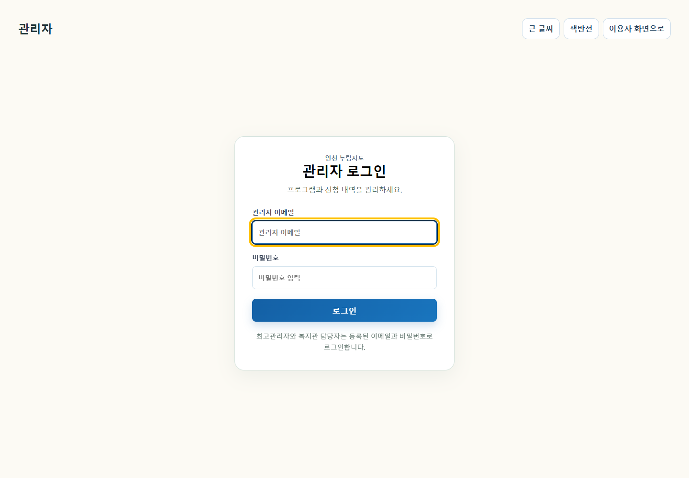
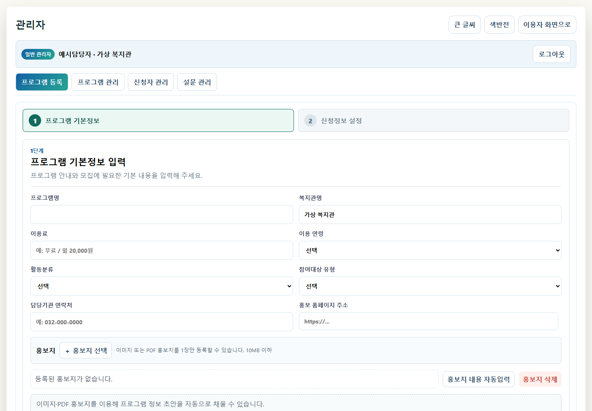
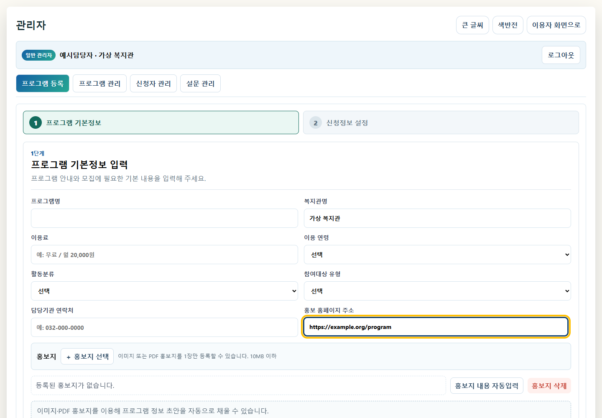
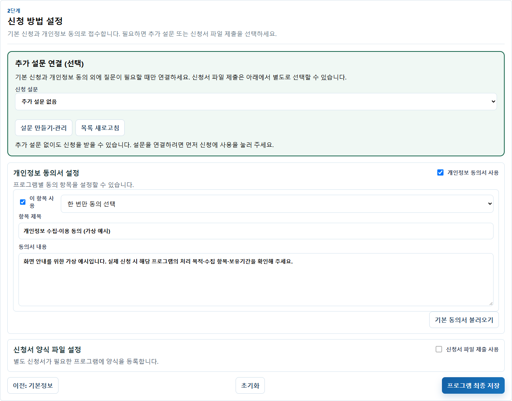
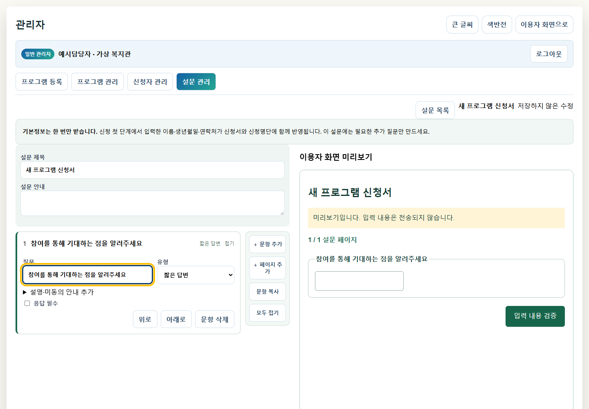
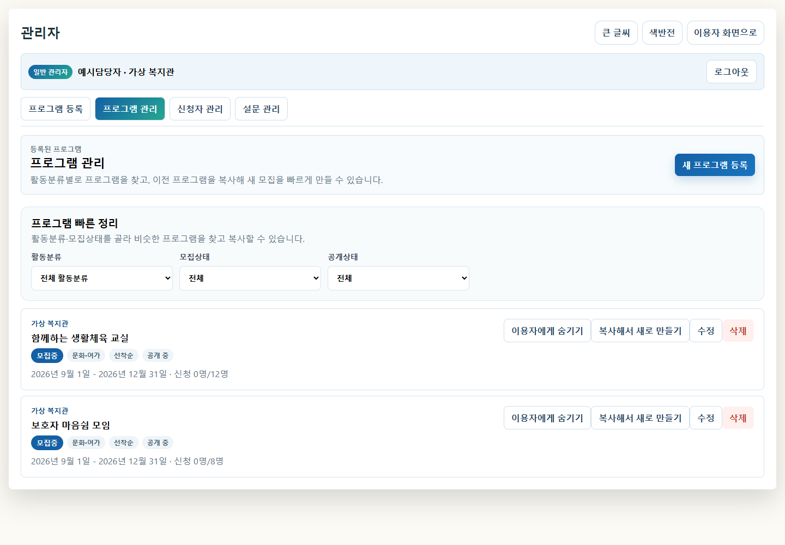
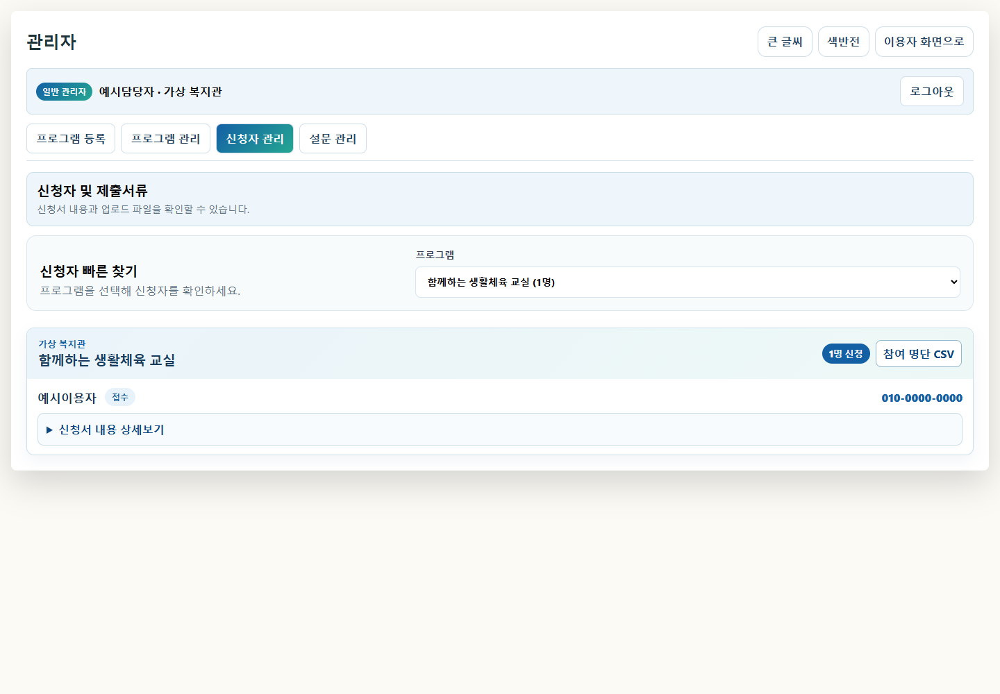

# 인천 누림지도 · 기관 관리자 화면 가이드

> 화면의 이름·연락처·프로그램은 안내용 예시입니다. 추가 설문 이미지는 미리보기 화면입니다.

## 1. 관리자 화면 열기·로그인

이용자 화면 위 관리자 버튼을 누르면 별도 탭에서 관리자 로그인 화면이 열립니다. 부여받은 계정으로 로그인합니다.

기관 담당자는 소속 기관의 업무를 처리합니다.

## 2. 프로그램 기본정보 등록

프로그램 등록에서 프로그램명, 이용료, 이용 연령, 활동분류, 참여대상, 연락처, 모집기간과 일정을 입력합니다. 아래쪽 항목까지 작성한 뒤 다음: 신청정보 설정으로 이동합니다.

홍보 홈페이지 주소에는 이용자가 상세 안내를 볼 수 있는 기관의 공지 주소를 입력합니다. 이 주소는 프로그램의 상세 안내 링크로 사용됩니다.

홍보지는 이미지 또는 PDF로 등록하고 **홍보지 내용 자동입력**을 누릅니다. 인식된 모집기간·참여대상·일정·이용료·연락처 등을 원문과 대조하여 수정한 뒤 저장합니다.

담당기관 연락처는 이용자 문의처와 만 14세 미만 개인정보 동의 안내에 표시되므로 정확하게 입력합니다.

## 3. 신청 방식 설정·최종 저장

프로그램에 필요한 개인정보 동의 항목을 확인하고, 필요에 따라 추가 설문 또는 신청서 파일 제출 방식을 설정합니다. 내용을 검토한 뒤 프로그램 최종 저장을 누릅니다.

개인정보 보유기간은 기관의 운영 기준에 맞게 설정합니다. 추가 설문은 설문 관리에서 준비하여 연결합니다. 저장 전에 이용자 화면과 신청 순서를 확인하세요.

## 4. 추가 설문 만들기

설문 관리에서 새 설문을 만들고 질문과 응답 유형을 정합니다. 왼쪽에서 문항을 편집하면서 오른쪽 이용자 화면 미리보기로 확인합니다.

문항 추가·페이지 추가·문항 복사를 활용합니다. 문항 제목 영역을 끌거나 위로·아래로 버튼으로 순서를 바꿀 수 있습니다. 편집 후 저장하고 신청에 사용을 통해 반영합니다.

## 5. 등록한 프로그램 관리

프로그램 관리에서 등록된 프로그램을 찾아 수정하거나 복사합니다. 새 모집을 시작할 때는 기존 프로그램을 복사한 뒤 대상·기간·정원 등을 새 내용으로 바꿉니다.

공개 여부와 모집 상태를 확인하고, 변경된 안내가 이용자 화면에도 올바르게 표시되는지 확인합니다.

## 6. 신청자·제출자료 확인

신청자 관리에서 프로그램을 선택하고 신청내역을 확인합니다. 참여 명단 CSV를 업무에 활용하고, 프로그램 설정에 따라 제출자료를 확인합니다.

만 14세 미만 신청자의 상세 정보에서는 아동과 보호자의 서명·동의 기록을 확인합니다. 보호자 서명 입력만으로 법정대리인의 신원·관계 확인이 완료되는 것은 아니므로 필요한 확인은 기관 절차에 따릅니다.

Google Drive 연계 자료는 사전 연결 및 실제 저장 상태를 확인한 후 사용합니다.

## 7. 관리자 화면의 큰 글씨·색반전

관리자 화면 상단의 **큰 글씨**와 **색반전** 버튼으로 화면을 조정합니다. 켜진 버튼을 다시 누르면 해제됩니다. 이용자 화면과 같은 브라우저의 설정을 공유하며, 키보드로도 조작할 수 있습니다.

## 최고관리자 업무

기관·담당자 계정과 권한, 검색항목 등 공통 운영 설정은 최고관리자 권한으로 관리합니다. 해당 메뉴는 최고관리자 계정으로 로그인했을 때 사용할 수 있습니다.
