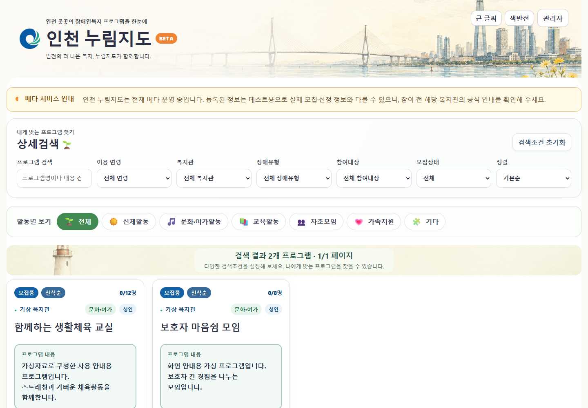
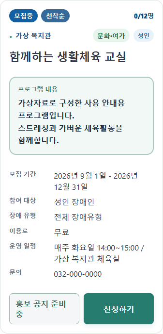
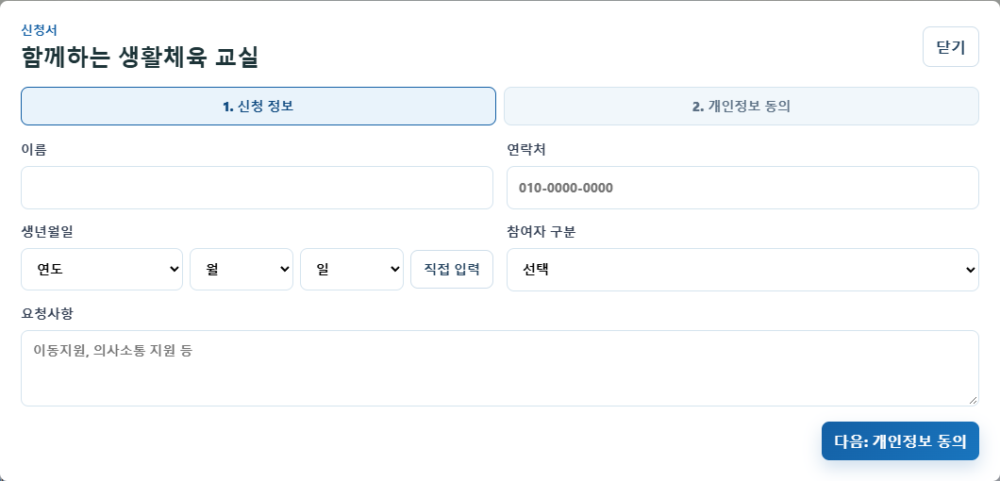
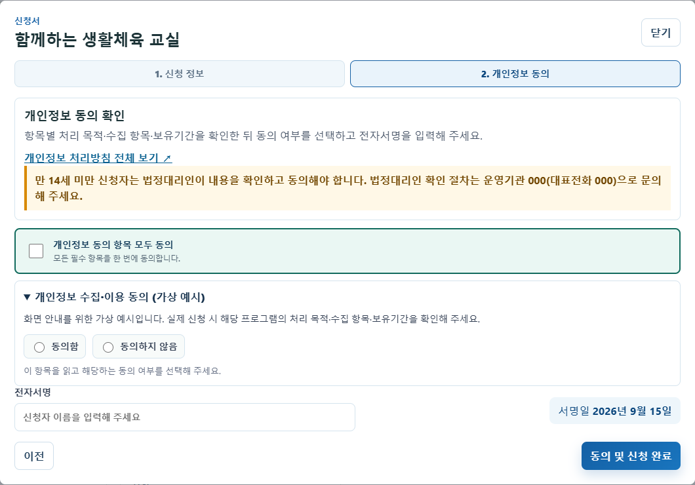
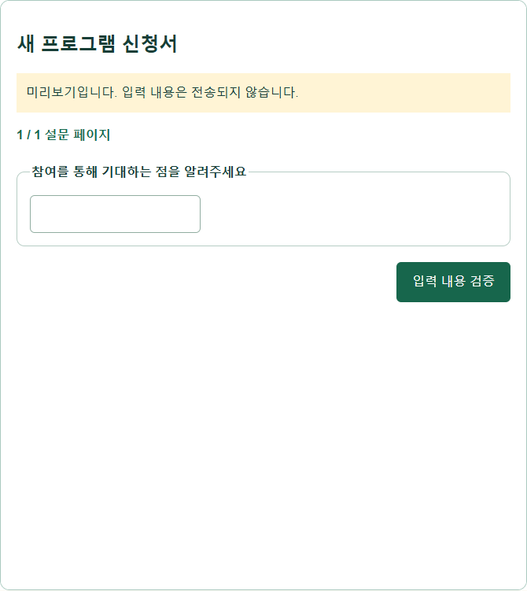
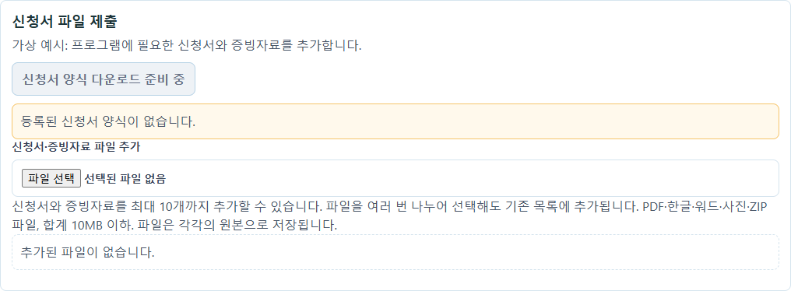
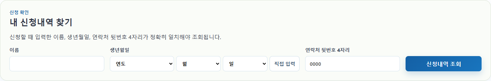

# 인천 누림지도 · 일반 이용자 화면 가이드

> 이 가이드는 인천 누림지도 v104의 실제 화면 소스를 실행하고 가상자료로 촬영한 화면 안내입니다. 운영 서비스에 로그인하거나 실제 신청·저장·개인정보 조회를 수행한 기록이 아닙니다. 추가 설문 이미지는 미리보기 화면입니다.

## 1. 프로그램 찾기

프로그램 검색에 원하는 이름이나 내용을 입력합니다. 이용 연령·복지관·장애유형·참여대상·모집상태를 선택하거나 활동별 분류를 눌러 범위를 좁힙니다.

다시 전체 목록을 보려면 검색조건 초기화를 누릅니다.

## 2. 프로그램 내용 확인

프로그램 카드에서 참여 대상, 모집기간, 이용료, 운영 일정과 문의처를 확인합니다. 모집 중인 프로그램의 신청하기를 누르면 신청 화면이 열립니다.

선착순·추첨 등 모집 방식과 정원·대기 여부를 함께 확인합니다. 이 화면의 프로그램은 가상 예시입니다.

## 3. 신청 정보 입력

이름, 연락처, 생년월일, 참여자 구분을 입력합니다. 필요한 요청사항을 적은 뒤 다음: 개인정보 동의를 누릅니다.

프로그램 설정에 따라 추가 설문이나 파일 첨부가 필요할 수 있습니다.

## 4. 개인정보 안내 확인

항목별 처리 목적·수집 항목·보유기간을 읽고 동의 여부를 선택합니다. 전자서명에는 신청자 이름을 입력하고 마지막 제출 버튼을 누릅니다.

이미지의 동의 문구는 가상 예시입니다. 실제 프로그램의 안내를 확인하세요. 제출 후 완료 안내를 확인하고, 추가 설문이 열리면 끝까지 진행합니다.

## 5. 필요한 경우: 추가 설문

프로그램에서 추가로 묻는 질문에 답합니다. 필수 문항과 선택 개수 등 안내를 확인하고 마지막 페이지까지 제출합니다.

이미지는 실제 설문 화면의 미리보기입니다. 미리보기의 입력 내용 검증은 실제 신청 제출이 아닙니다. 실제 신청 시에는 해당 화면의 제출 안내를 따릅니다.

## 6. 필요한 경우: 신청서·증빙자료 첨부

신청서 파일 제출을 사용하는 프로그램에서는 안내에 따라 양식을 작성하고 파일을 추가합니다. PDF·한글·워드·사진·ZIP을 최대 10개, 합계 10MB까지 추가할 수 있습니다.

여러 번 선택하면 기존 목록에 추가됩니다. 제출 전 파일을 확인하고 잘못 선택한 파일은 목록에서 삭제합니다.

## 7. 내 신청내역 찾기

화면 아래 내 신청내역 찾기에서 신청 당시 이름, 생년월일, 연락처 뒷번호 4자리를 입력하고 신청내역 조회를 누릅니다.

입력정보가 정확히 일치해야 조회됩니다. 접수 완료와 최종 참여자 선정은 다를 수 있으므로 기관 안내를 확인합니다.

## 8. 보기 편한 화면으로 조정

화면 위 큰 글씨와 색반전 버튼으로 글씨 크기와 색상 표현을 조정합니다.

이용에 어려움이 있거나 신청내역이 확인되지 않으면 프로그램에 표시된 기관 문의처로 연락합니다.
